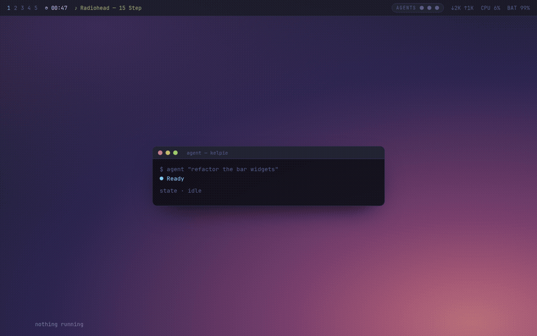

# Ambient Agent 🫧

**Your Omarchy desktop feels what your AI agents are doing — no pop-ups.**

The screen edge *breathes* cyan while an agent works, warms to amber the moment one **needs your call**, and gives a quiet green pulse when it's done. Peripheral awareness, not interruption.

> `omarchy.agents` shows agent *usage and limits*. Ambient Agent shows the thing that actually costs you time when you run several agents at once: **which one is silently waiting for you.**

**▶ [Live demo & docs](https://fjalvarezdd.github.io/omarchy-ambient-agent/)**  ·  by [@fjalvarezdd](https://github.com/fjalvarezdd)



## Install (one command)

```bash
omarchy plugin add https://github.com/fjalvarezdd/omarchy-ambient-agent --enable
```

That's it. The plugin drops in, enables itself, and on first run installs the tiny `agent-ambient` helper and a default config. No clone, no build.

## Drive it

Set the state from anywhere:

```bash
agent-ambient working   # slow cyan breathing
agent-ambient needs     # amber pulse — an agent is blocked on you
agent-ambient done      # green flash, then calm
agent-ambient error     # red pulse
agent-ambient idle      # off
```

Wrap any long task so the edge tracks it automatically:

```bash
agent-ambient working; npm run build; agent-ambient done
```

If your agent or editor can run a command on events, point it at `agent-ambient <state>` — e.g. *starting a task* → `working`, *waiting for your approval* → `needs`, *finished* → `done`. A ready-to-adapt hook example lives in [`hooks/`](hooks/).

## Configure it

Edit `~/.config/omarchy/ambient-agent.json` — it hot-reloads, no restart:

```json
{
  "enabled": true,
  "borderWidth": 3,
  "glowWidth": 26,
  "glowOpacity": 0.40,
  "radius": 16,
  "colors": { "working": "#7dcfff", "needs": "#e0af68", "done": "#9ece6a", "error": "#f7768e" },
  "periods": { "working": 3800, "needs": 1500, "error": 1100 },
  "doneTimeoutMs": 2500
}
```

Match your theme with `colors`; calm it down with a smaller `glowWidth` / `glowOpacity`; slow the breathing with bigger `periods`; set `"enabled": false` to switch it off without uninstalling.

| State | Color | Motion |
|-------|-------|--------|
| working | cyan `#7dcfff` | breathe 3.8s |
| needs you | amber `#e0af68` | pulse 1.5s |
| done | green `#9ece6a` | flash once |
| error | red `#f7768e` | pulse 1.1s |
| idle | — | off |

## How it works

A tiny Quickshell layer-shell overlay (transparent, click-through, `WlrLayer.Overlay`) draws the edge glow, driven by a one-word state file at `~/.local/state/omarchy/agent-ambient`. No daemon, no dependencies beyond Omarchy's shell.

## Uninstall

```bash
omarchy plugin remove ambient-agent
rm -f ~/.local/bin/agent-ambient ~/.config/omarchy/ambient-agent.json
```

## Roadmap
- Per-agent orbs in the bar (N agents); the edge shows the most urgent state.
- Soft blurred glow and per-edge direction hints.

MIT · built for [Omarchy](https://omarchy.org).
